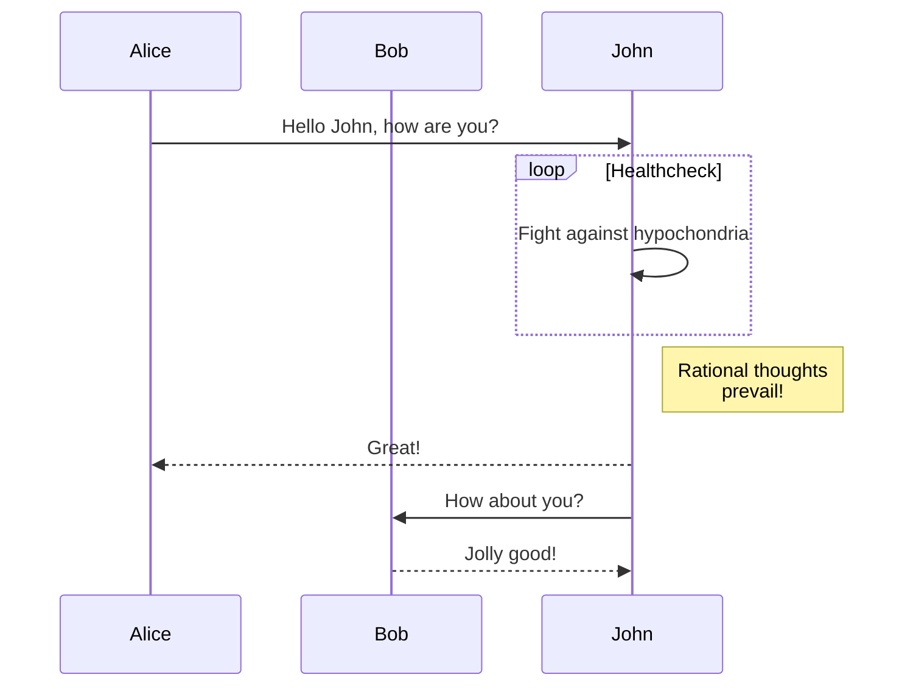
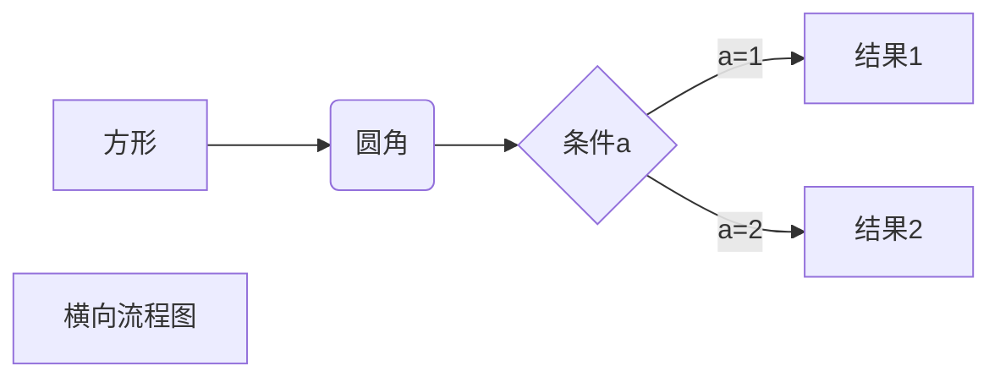
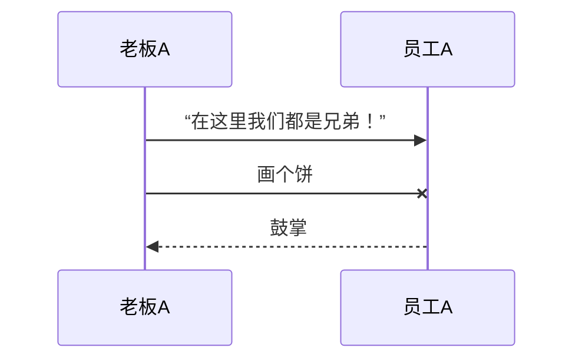

### 关键数据结构

NettyServer

NettyServerHandler


### Server 启动

start:169, **NettyServer** (io.grpc.netty.shaded.io.grpc.netty) 

start:183, ServerImpl (io.grpc.internal) 

start:90, ServerImpl (io.grpc.internal) 

start:45, RpcServer 

main:89, RpcServer


io.grpc.netty.NettyServer#start中：

1. 创建ServerBootstrap并绑定端口

2. 注册ChannelHandler ，在ChannelInitializer中创建NettyServerTransport

   ```java
   @Override
     public void start(ServerListener serverListener) throws IOException {
       listener = checkNotNull(serverListener, "serverListener");
   
       ServerBootstrap b = new ServerBootstrap();
       b.option(ALLOCATOR, Utils.getByteBufAllocator(forceHeapBuffer));
       b.childOption(ALLOCATOR, Utils.getByteBufAllocator(forceHeapBuffer));
       b.group(bossGroup, workerGroup);
       b.channelFactory(channelFactory);
       // For non-socket based channel, the option will be ignored.
       b.childOption(SO_KEEPALIVE, true);
   
       b.childHandler(new ChannelInitializer<Channel>() {
         @Override
         public void initChannel(Channel ch) {
   
           ChannelPromise channelDone = ch.newPromise();
   
           long maxConnectionAgeInNanos = NettyServer.this.maxConnectionAgeInNanos;
           if (maxConnectionAgeInNanos != MAX_CONNECTION_AGE_NANOS_DISABLED) {
             // apply a random jitter of +/-10% to max connection age
             maxConnectionAgeInNanos =
                 (long) ((.9D + Math.random() * .2D) * maxConnectionAgeInNanos);
           }
   
           NettyServerTransport transport =
               new NettyServerTransport(
                   ch,
                   channelDone,
                   protocolNegotiator,
                   streamTracerFactories,
                   transportTracerFactory.create(),
                   maxStreamsPerConnection,
                   autoFlowControl,
                   flowControlWindow,
                   maxMessageSize,
                   maxHeaderListSize,
                   keepAliveTimeInNanos,
                   keepAliveTimeoutInNanos,
                   maxConnectionIdleInNanos,
                   maxConnectionAgeInNanos,
                   maxConnectionAgeGraceInNanos,
                   permitKeepAliveWithoutCalls,
                   permitKeepAliveTimeInNanos);
           ServerTransportListener transportListener;
           // This is to order callbacks on the listener, not to guard access to channel.
           synchronized (NettyServer.this) {
             if (channel != null && !channel.isOpen()) {
               // Server already shutdown.
               ch.close();
               return;
             }
             // `channel` shutdown can race with `ch` initialization, so this is only safe to increment
             // inside the lock.
             sharedResourceReferenceCounter.retain();
             transportListener = listener.transportCreated(transport);
           }
   
           /**
            * Releases the event loop if the channel is "done", possibly due to the channel closing.
            */
           final class LoopReleaser implements ChannelFutureListener {
             private boolean done;
   
             @Override
             public void operationComplete(ChannelFuture future) throws Exception {
               if (!done) {
                 done = true;
                 sharedResourceReferenceCounter.release();
               }
             }
           }
   
           transport.start(transportListener);
           ChannelFutureListener loopReleaser = new LoopReleaser();
           channelDone.addListener(loopReleaser);
           ch.closeFuture().addListener(loopReleaser);
         }
       });
       // Bind and start to accept incoming connections.
       ChannelFuture future = b.bind(address);
       // We'd love to observe interruption, but if interrupted we will need to close the channel,
       // which itself would need an await() to guarantee the port is not used when the method returns.
       // See #6850
       future.awaitUninterruptibly();
       if (!future.isSuccess()) {
         throw new IOException("Failed to bind", future.cause());
       }
       channel = future.channel();
       channel.eventLoop().execute(new Runnable() {
         @Override
         public void run() {
           listenSocketStats = new ListenSocket(channel);
           channelz.addListenSocket(listenSocketStats);
         }
       });
     }
   ```


io.grpc.netty.**NettyServerTransport**#start

创建NettyServerHandler并注册到pipeline：

```java
public void start(ServerTransportListener listener) {
    Preconditions.checkState(this.listener == null, "Handler already registered");
    this.listener = listener;

    // Create the Netty handler for the pipeline.
    grpcHandler = createHandler(listener, channelUnused);

    // Notify when the channel closes.
    final class TerminationNotifier implements ChannelFutureListener {
      boolean done;

      @Override
      public void operationComplete(ChannelFuture future) throws Exception {
        if (!done) {
          done = true;
          notifyTerminated(grpcHandler.connectionError());
        }
      }
    }

    ChannelHandler negotiationHandler = protocolNegotiator.newHandler(grpcHandler);
    ChannelHandler bufferingHandler = new WriteBufferingAndExceptionHandler(negotiationHandler);

    ChannelFutureListener terminationNotifier = new TerminationNotifier();
    channelUnused.addListener(terminationNotifier);
    channel.closeFuture().addListener(terminationNotifier);

    channel.pipeline().addLast(bufferingHandler);
  }
```



``` 

```




