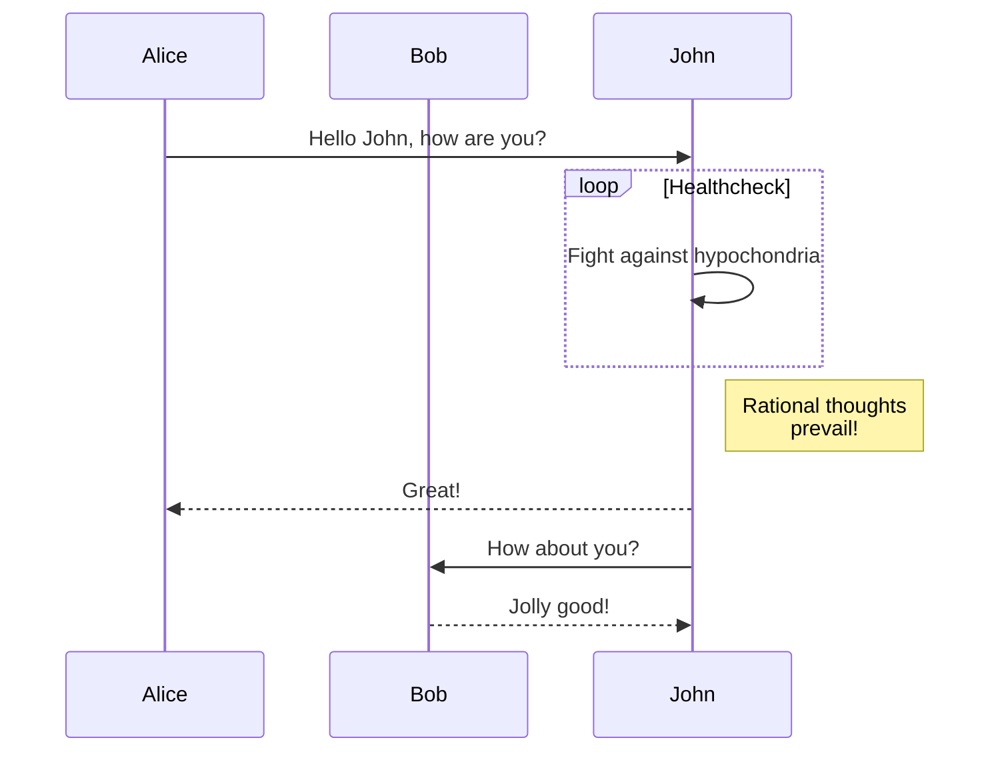
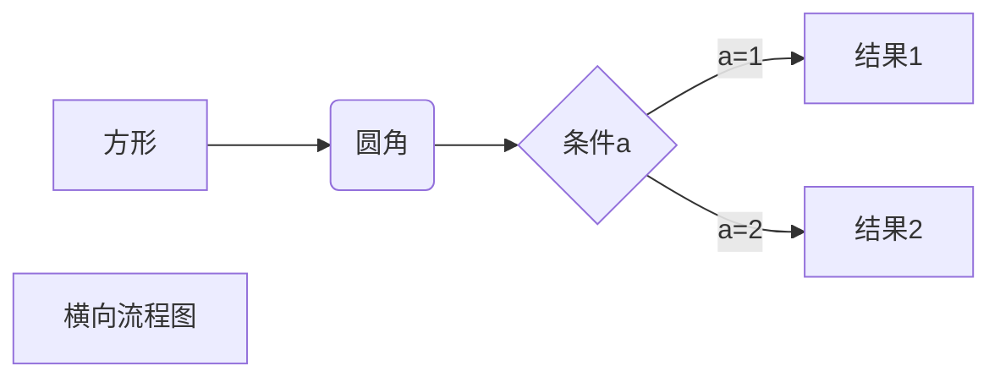

---
layout: post
title: grpc源代码
category:  技术
tags: grpc
description: 本文经原作者同意后进行转载和翻译
---


### 关键数据结构

NettyServer

NettyServerHandler


### Server 启动

start:169, **NettyServer** (io.grpc.netty.shaded.io.grpc.netty) 

start:183, ServerImpl (io.grpc.internal) 

start:90, ServerImpl (io.grpc.internal) 

start:45, RpcServer 

main:89, RpcServer


io.grpc.netty.NettyServer#start中：

1. 创建ServerBootstrap并绑定端口

2. 注册ChannelHandler ，在ChannelInitializer中创建NettyServerTransport

   ```java
   @Override
     public void start(ServerListener serverListener) throws IOException {
       listener = checkNotNull(serverListener, "serverListener");
   
       ServerBootstrap b = new ServerBootstrap();
       b.option(ALLOCATOR, Utils.getByteBufAllocator(forceHeapBuffer));
       b.childOption(ALLOCATOR, Utils.getByteBufAllocator(forceHeapBuffer));
       b.group(bossGroup, workerGroup);
       b.channelFactory(channelFactory);
       // For non-socket based channel, the option will be ignored.
       b.childOption(SO_KEEPALIVE, true);
   
       b.childHandler(new ChannelInitializer<Channel>() {
         @Override
         public void initChannel(Channel ch) {
   
           ChannelPromise channelDone = ch.newPromise();
   
           long maxConnectionAgeInNanos = NettyServer.this.maxConnectionAgeInNanos;
           if (maxConnectionAgeInNanos != MAX_CONNECTION_AGE_NANOS_DISABLED) {
             // apply a random jitter of +/-10% to max connection age
             maxConnectionAgeInNanos =
                 (long) ((.9D + Math.random() * .2D) * maxConnectionAgeInNanos);
           }
   
           NettyServerTransport transport =
               new NettyServerTransport(
                   ch,
                   channelDone,
                   protocolNegotiator,
                   streamTracerFactories,
                   transportTracerFactory.create(),
                   maxStreamsPerConnection,
                   autoFlowControl,
                   flowControlWindow,
                   maxMessageSize,
                   maxHeaderListSize,
                   keepAliveTimeInNanos,
                   keepAliveTimeoutInNanos,
                   maxConnectionIdleInNanos,
                   maxConnectionAgeInNanos,
                   maxConnectionAgeGraceInNanos,
                   permitKeepAliveWithoutCalls,
                   permitKeepAliveTimeInNanos);
           ServerTransportListener transportListener;
           // This is to order callbacks on the listener, not to guard access to channel.
           synchronized (NettyServer.this) {
             if (channel != null && !channel.isOpen()) {
               // Server already shutdown.
               ch.close();
               return;
             }
             // `channel` shutdown can race with `ch` initialization, so this is only safe to increment
             // inside the lock.
             sharedResourceReferenceCounter.retain();
             transportListener = listener.transportCreated(transport);
           }
   
           /**
            * Releases the event loop if the channel is "done", possibly due to the channel closing.
            */
           final class LoopReleaser implements ChannelFutureListener {
             private boolean done;
   
             @Override
             public void operationComplete(ChannelFuture future) throws Exception {
               if (!done) {
                 done = true;
                 sharedResourceReferenceCounter.release();
               }
             }
           }
   
           transport.start(transportListener);
           ChannelFutureListener loopReleaser = new LoopReleaser();
           channelDone.addListener(loopReleaser);
           ch.closeFuture().addListener(loopReleaser);
         }
       });
       // Bind and start to accept incoming connections.
       ChannelFuture future = b.bind(address);
       // We'd love to observe interruption, but if interrupted we will need to close the channel,
       // which itself would need an await() to guarantee the port is not used when the method returns.
       // See #6850
       future.awaitUninterruptibly();
       if (!future.isSuccess()) {
         throw new IOException("Failed to bind", future.cause());
       }
       channel = future.channel();
       channel.eventLoop().execute(new Runnable() {
         @Override
         public void run() {
           listenSocketStats = new ListenSocket(channel);
           channelz.addListenSocket(listenSocketStats);
         }
       });
     }
   ```


io.grpc.netty.**NettyServerTransport**#start

创建三个handler并注册到pipeline：

**NettyServerHandler**

**WriteBufferingAndExceptionHandler**

在plaintext模式下，其他两个handler为：

**GrpcNegotiationHandler**   

**WaitUntilActiveHandler**

 

```java
public void start(ServerTransportListener listener) {
    Preconditions.checkState(this.listener == null, "Handler already registered");
    this.listener = listener;

    // Create the Netty handler for the pipeline.
    grpcHandler = createHandler(listener, channelUnused);

    // Notify when the channel closes.
    final class TerminationNotifier implements ChannelFutureListener {
      boolean done;

      @Override
      public void operationComplete(ChannelFuture future) throws Exception {
        if (!done) {
          done = true;
          notifyTerminated(grpcHandler.connectionError());
        }
      }
    }

    ChannelHandler negotiationHandler = protocolNegotiator.newHandler(grpcHandler);
    ChannelHandler bufferingHandler = new WriteBufferingAndExceptionHandler(negotiationHandler);

    ChannelFutureListener terminationNotifier = new TerminationNotifier();
    channelUnused.addListener(terminationNotifier);
    channel.closeFuture().addListener(terminationNotifier);

    channel.pipeline().addLast(bufferingHandler);
  }

```







##### DelayedClientTransport

A client transport that queues requests before a real transport is available. When reprocess is called, this class applies the provided io.grpc.LoadBalancer.SubchannelPicker to pick a transport for each pending stream.
This transport owns every stream that it has created until a real transport has been picked for that stream, at which point the ownership of the stream is transferred to the real transport, thus the delayed transport stops owning the stream.

```
<init>:98, DelayedClientTransport (io.grpc.internal)
<init>:608, ManagedChannelImpl (io.grpc.internal)
build:517, AbstractManagedChannelImplBuilder (io.grpc.internal)
<init>:64, RouteGuideClient (routeguide)
main:374, RouteGuideClient (routeguide)
```


##### DelayedStream

A stream that queues requests before the transport is available, and delegates to a real stream implementation when the transport is available.
ClientStream itself doesn't require thread-safety. However, the state of DelayedStream may be internally altered by different threads, thus internal synchronization is necessary.


##### ForwardingClientStream


##### InternalSubchannel.CallTracingTransport


io.grpc.internal.ClientCallImpl#startInternal：

1. 创建CallTracingTransport
2. 创建ForwardingClientStream


NameResolver获取server地址列表：

```
onResult:1465, ManagedChannelImpl$NameResolverListener (io.grpc.internal)
onAddresses:320, NameResolver$Listener2 (io.grpc)
loadServiceNodes:111, ZooKeeperNameResolver (routeguide)
start:68, ZooKeeperNameResolver (routeguide)
start:103, NameResolver (io.grpc)
exitIdleMode:381, ManagedChannelImpl (io.grpc.internal)
run:469, ManagedChannelImpl$ChannelTransportProvider$1ExitIdleModeForTransport (io.grpc.internal)
drain:95, SynchronizationContext (io.grpc)
execute:127, SynchronizationContext (io.grpc)
get:473, ManagedChannelImpl$ChannelTransportProvider (io.grpc.internal)
startInternal:253, ClientCallImpl (io.grpc.internal)
start:210, ClientCallImpl (io.grpc.internal)
start:32, ForwardingClientCall (io.grpc)
start:19, HeaderClientInterceptor$1 (routeguide)
startCall:314, ClientCalls (io.grpc.stub)
asyncUnaryRequestCall:288, ClientCalls (io.grpc.stub)
futureUnaryCall:200, ClientCalls (io.grpc.stub)
blockingUnaryCall:132, ClientCalls (io.grpc.stub)
getFeature:404, RouteGuideGrpc$RouteGuideBlockingStub (routeguide)
getFeature:123, RouteGuideClient (routeguide)
main:402, RouteGuideClient (routeguide)
```


  获取ClientTransport

```java
public ClientTransport get(PickSubchannelArgs args) {
  SubchannelPicker pickerCopy = subchannelPicker;
  if (shutdown.get()) {
    // If channel is shut down, delayedTransport is also shut down which will fail the stream
    // properly.
    return delayedTransport;
  }
  if (pickerCopy == null) {
    final class ExitIdleModeForTransport implements Runnable {
      @Override
      public void run() {
        exitIdleMode();
      }
    }

    syncContext.execute(new ExitIdleModeForTransport());
    return delayedTransport;
  }
```

**exitIdleMode**调用用户定义的ZooKeeperNameResolver#start获取server地址列表。


io.grpc.internal.ManagedChannelImpl.NameResolverListener#**onResult** 获取到地址列表后，由SynchronizationContext执行io.grpc.util.RoundRobinLoadBalancer#***handleResolvedAddresses***，创建channel。


```
handleResolvedAddresses:73, RoundRobinLoadBalancer (io.grpc.util)
tryHandleResolvedAddresses:165, AutoConfiguredLoadBalancerFactory$AutoConfiguredLoadBalancer (io.grpc.internal)
run:1451, ManagedChannelImpl$NameResolverListener$1NamesResolved (io.grpc.internal)
drain:95, SynchronizationContext (io.grpc)
execute:127, SynchronizationContext (io.grpc)
get:473, ManagedChannelImpl$ChannelTransportProvider (io.grpc.internal)
startInternal:253, ClientCallImpl (io.grpc.internal)
start:210, ClientCallImpl (io.grpc.internal)
start:32, ForwardingClientCall (io.grpc)
start:19, HeaderClientInterceptor$1 (routeguide)
startCall:314, ClientCalls (io.grpc.stub)
asyncUnaryRequestCall:288, ClientCalls (io.grpc.stub)
futureUnaryCall:200, ClientCalls (io.grpc.stub)
blockingUnaryCall:132, ClientCalls (io.grpc.stub)
getFeature:404, RouteGuideGrpc$RouteGuideBlockingStub (routeguide)
getFeature:123, RouteGuideClient (routeguide)
main:402, RouteGuideClient (routeguide)


```


```java
@Override
public void onResult(final ResolutionResult resolutionResult) {
  final class NamesResolved implements Runnable {

    @SuppressWarnings("ReferenceEquality")
    @Override
    public void run() {

      List<EquivalentAddressGroup> servers = resolutionResult.getAddresses();
      channelLogger.log(
          ChannelLogLevel.DEBUG,
          "Resolved address: {0}, config={1}",
          servers,
          resolutionResult.getAttributes());

      if (lastResolutionState != ResolutionState.SUCCESS) {
        channelLogger.log(ChannelLogLevel.INFO, "Address resolved: {0}", servers);
        lastResolutionState = ResolutionState.SUCCESS;
      }

      nameResolverBackoffPolicy = null;
      ConfigOrError configOrError = resolutionResult.getServiceConfig();
      ManagedChannelServiceConfig validServiceConfig =
          configOrError != null && configOrError.getConfig() != null
              ? (ManagedChannelServiceConfig) resolutionResult.getServiceConfig().getConfig()
              : null;
      Status serviceConfigError = configOrError != null ? configOrError.getError() : null;

      ManagedChannelServiceConfig effectiveServiceConfig;
      if (!lookUpServiceConfig) {
        if (validServiceConfig != null) {
          channelLogger.log(
              ChannelLogLevel.INFO,
              "Service config from name resolver discarded by channel settings");
        }
        effectiveServiceConfig =
            defaultServiceConfig == null ? EMPTY_SERVICE_CONFIG : defaultServiceConfig;
      } else {
        // Try to use config if returned from name resolver
        // Otherwise, try to use the default config if available
        if (validServiceConfig != null) {
          effectiveServiceConfig = validServiceConfig;
        } else if (defaultServiceConfig != null) {
          effectiveServiceConfig = defaultServiceConfig;
          channelLogger.log(
              ChannelLogLevel.INFO,
              "Received no service config, using default service config");
        } else if (serviceConfigError != null) {
          if (!serviceConfigUpdated) {
            // First DNS lookup has invalid service config, and cannot fall back to default
            channelLogger.log(
                ChannelLogLevel.INFO,
                "Fallback to error due to invalid first service config without default config");
            onError(configOrError.getError());
            return;
          } else {
            effectiveServiceConfig = lastServiceConfig;
          }
        } else {
          effectiveServiceConfig = EMPTY_SERVICE_CONFIG;
        }
        if (!effectiveServiceConfig.equals(lastServiceConfig)) {
          channelLogger.log(
              ChannelLogLevel.INFO,
              "Service config changed{0}",
              effectiveServiceConfig == EMPTY_SERVICE_CONFIG ? " to empty" : "");
          lastServiceConfig = effectiveServiceConfig;
        }

        try {
          // TODO(creamsoup): when `servers` is empty and lastResolutionStateCopy == SUCCESS
          //  and lbNeedAddress, it shouldn't call the handleServiceConfigUpdate. But,
          //  lbNeedAddress is not deterministic
          handleServiceConfigUpdate();
        } catch (RuntimeException re) {
          logger.log(
              Level.WARNING,
              "[" + getLogId() + "] Unexpected exception from parsing service config",
              re);
        }
      }

      Attributes effectiveAttrs = resolutionResult.getAttributes();
      // Call LB only if it's not shutdown.  If LB is shutdown, lbHelper won't match.
      if (NameResolverListener.this.helper == ManagedChannelImpl.this.lbHelper) {
        Map<String, ?> healthCheckingConfig =
            effectiveServiceConfig.getHealthCheckingConfig();
        if (healthCheckingConfig != null) {
          effectiveAttrs = effectiveAttrs.toBuilder()
              .set(LoadBalancer.ATTR_HEALTH_CHECKING_CONFIG, healthCheckingConfig)
              .build();
        }

        Status handleResult = helper.lb.tryHandleResolvedAddresses(
            ResolvedAddresses.newBuilder()
                .setAddresses(servers)
                .setAttributes(effectiveAttrs)
                .setLoadBalancingPolicyConfig(effectiveServiceConfig.getLoadBalancingConfig())
                .build());

        if (!handleResult.isOk()) {
          handleErrorInSyncContext(handleResult.augmentDescription(resolver + " was used"));
        }
      }
    }
  }

  syncContext.execute(new NamesResolved());
}
```


io.grpc.util.RoundRobinLoadBalancer#***handleResolvedAddresses***

1. 创建创建**Subchannel**
2. 创建**InternalSubchannel**
3. 创建**ClientTransport**

```java
@Override
public void handleResolvedAddresses(ResolvedAddresses resolvedAddresses) {
  List<EquivalentAddressGroup> servers = resolvedAddresses.getAddresses();
  Set<EquivalentAddressGroup> currentAddrs = subchannels.keySet();
  Map<EquivalentAddressGroup, EquivalentAddressGroup> latestAddrs = stripAttrs(servers);
  Set<EquivalentAddressGroup> removedAddrs = setsDifference(currentAddrs, latestAddrs.keySet());

  for (Map.Entry<EquivalentAddressGroup, EquivalentAddressGroup> latestEntry :
      latestAddrs.entrySet()) {
    EquivalentAddressGroup strippedAddressGroup = latestEntry.getKey();
    EquivalentAddressGroup originalAddressGroup = latestEntry.getValue();
    Subchannel existingSubchannel = subchannels.get(strippedAddressGroup);
    if (existingSubchannel != null) {
      // EAG's Attributes may have changed.
      existingSubchannel.updateAddresses(Collections.singletonList(originalAddressGroup));
      continue;
    }
    // Create new subchannels for new addresses.

    // NB(lukaszx0): we don't merge `attributes` with `subchannelAttr` because subchannel
    // doesn't need them. They're describing the resolved server list but we're not taking
    // any action based on this information.
    Attributes.Builder subchannelAttrs = Attributes.newBuilder()
        // NB(lukaszx0): because attributes are immutable we can't set new value for the key
        // after creation but since we can mutate the values we leverage that and set
        // AtomicReference which will allow mutating state info for given channel.
        .set(STATE_INFO,
            new Ref<>(ConnectivityStateInfo.forNonError(IDLE)));

    final Subchannel subchannel = checkNotNull(
        helper.createSubchannel(CreateSubchannelArgs.newBuilder()
            .setAddresses(originalAddressGroup)
            .setAttributes(subchannelAttrs.build())
            .build()),
        "subchannel");
    subchannel.start(new SubchannelStateListener() {
        @Override
        public void onSubchannelState(ConnectivityStateInfo state) {
          processSubchannelState(subchannel, state);
        }
      });
    subchannels.put(strippedAddressGroup, subchannel);
    subchannel.requestConnection();
  }

  ArrayList<Subchannel> removedSubchannels = new ArrayList<>();
  for (EquivalentAddressGroup addressGroup : removedAddrs) {
    removedSubchannels.add(subchannels.remove(addressGroup));
  }

  // Update the picker before shutting down the subchannels, to reduce the chance of the race
  // between picking a subchannel and shutting it down.
  updateBalancingState();

  // Shutdown removed subchannels
  for (Subchannel removedSubchannel : removedSubchannels) {
    shutdownSubchannel(removedSubchannel);
  }
}
```


subchannel.requestConnection()获取ActiveTransport

```
obtainActiveTransport:190, InternalSubchannel (io.grpc.internal)
requestConnection:1698, ManagedChannelImpl$SubchannelImpl (io.grpc.internal)
handleResolvedAddresses:113, RoundRobinLoadBalancer (io.grpc.util)
tryHandleResolvedAddresses:165, AutoConfiguredLoadBalancerFactory$AutoConfiguredLoadBalancer (io.grpc.internal)
run:1451, ManagedChannelImpl$NameResolverListener$1NamesResolved (io.grpc.internal)
drain:95, SynchronizationContext (io.grpc)
execute:127, SynchronizationContext (io.grpc)
get:473, ManagedChannelImpl$ChannelTransportProvider (io.grpc.internal)
startInternal:253, ClientCallImpl (io.grpc.internal)
start:210, ClientCallImpl (io.grpc.internal)
start:32, ForwardingClientCall (io.grpc)
start:19, HeaderClientInterceptor$1 (routeguide)
startCall:314, ClientCalls (io.grpc.stub)
asyncUnaryRequestCall:288, ClientCalls (io.grpc.stub)
futureUnaryCall:200, ClientCalls (io.grpc.stub)
blockingUnaryCall:132, ClientCalls (io.grpc.stub)
getFeature:404, RouteGuideGrpc$RouteGuideBlockingStub (routeguide)
getFeature:123, RouteGuideClient (routeguide)
main:402, RouteGuideClient (routeguide)
```

InternalSubchannel#obtainActiveTransport获取ClientTransport：如果已经存在，返回当前的activeTransport；如果不存在，则创建新的。

```java
@Override
public ClientTransport obtainActiveTransport() {
  ClientTransport savedTransport = activeTransport;
  if (savedTransport != null) {
    return savedTransport;
  }
  syncContext.execute(new Runnable() {
    @Override
    public void run() {
      if (state.getState() == IDLE) {
        channelLogger.log(ChannelLogLevel.INFO, "CONNECTING as requested");
        gotoNonErrorState(CONNECTING);
        startNewTransport();
      }
    }
  });
  return null;
}
```


##### 创建CallTracingTransport

```java
private void startNewTransport() {
  syncContext.throwIfNotInThisSynchronizationContext();

  Preconditions.checkState(reconnectTask == null, "Should have no reconnectTask scheduled");

  if (addressIndex.isAtBeginning()) {
    connectingTimer.reset().start();
  }
  SocketAddress address = addressIndex.getCurrentAddress();

  HttpConnectProxiedSocketAddress proxiedAddr = null;
  if (address instanceof HttpConnectProxiedSocketAddress) {
    proxiedAddr = (HttpConnectProxiedSocketAddress) address;
    address = proxiedAddr.getTargetAddress();
  }

  Attributes currentEagAttributes = addressIndex.getCurrentEagAttributes();
  String eagChannelAuthority = currentEagAttributes
          .get(EquivalentAddressGroup.ATTR_AUTHORITY_OVERRIDE);
  ClientTransportFactory.ClientTransportOptions options =
      new ClientTransportFactory.ClientTransportOptions()
        .setAuthority(eagChannelAuthority != null ? eagChannelAuthority : authority)
        .setEagAttributes(currentEagAttributes)
        .setUserAgent(userAgent)
        .setHttpConnectProxiedSocketAddress(proxiedAddr);
  TransportLogger transportLogger = new TransportLogger();
  // In case the transport logs in the constructor, use the subchannel logId
  transportLogger.logId = getLogId();
  ConnectionClientTransport transport =
      new CallTracingTransport(
          transportFactory
              .newClientTransport(address, options, transportLogger), callsTracer);
  transportLogger.logId = transport.getLogId();
  channelz.addClientSocket(transport);
  pendingTransport = transport;
  transports.add(transport);
  Runnable runnable = transport.start(new TransportListener(transport, address));
  if (runnable != null) {
    syncContext.executeLater(runnable);
  }
  channelLogger.log(ChannelLogLevel.INFO, "Started transport {0}", transportLogger.logId);
}
```


**CreateStreamCommand**

```
enqueue:81, WriteQueue (io.grpc.netty.shaded.io.grpc.netty)
writeHeadersInternal:168, NettyClientStream$Sink (io.grpc.netty.shaded.io.grpc.netty)
writeHeaders:124, NettyClientStream$Sink (io.grpc.netty.shaded.io.grpc.netty)
start:166, AbstractClientStream (io.grpc.internal)
start:87, ForwardingClientStream (io.grpc.internal)
start:681, InternalSubchannel$CallTracingTransport$1 (io.grpc.internal)
startInternal:287, ClientCallImpl (io.grpc.internal)
start:210, ClientCallImpl (io.grpc.internal)
start:32, ForwardingClientCall (io.grpc)
start:19, HeaderClientInterceptor$1 (routeguide)
startCall:314, ClientCalls (io.grpc.stub)
asyncUnaryRequestCall:288, ClientCalls (io.grpc.stub)
futureUnaryCall:200, ClientCalls (io.grpc.stub)
blockingUnaryCall:132, ClientCalls (io.grpc.stub)
getFeature:404, RouteGuideGrpc$RouteGuideBlockingStub (routeguide)
getFeature:123, RouteGuideClient (routeguide)
main:402, RouteGuideClient (routeguide)
```


io.grpc.netty.shaded.io.grpc.netty.NettyClientStream.Sink#**writeHeadersInternal**

```java
private void writeHeadersInternal(Metadata headers, byte[] requestPayload) {
    AsciiString defaultPath = (AsciiString)NettyClientStream.methodDescriptorAccessor.geRawMethodName(NettyClientStream.this.method);
    if (defaultPath == null) {
        defaultPath = new AsciiString("/" + NettyClientStream.this.method.getFullMethodName());
        NettyClientStream.methodDescriptorAccessor.setRawMethodName(NettyClientStream.this.method, defaultPath);
    }

    boolean get = requestPayload != null;
    AsciiString httpMethod;
    if (get) {
        defaultPath = new AsciiString(defaultPath + "?" + BaseEncoding.base64().encode(requestPayload));
        httpMethod = Utils.HTTP_GET_METHOD;
    } else {
        httpMethod = Utils.HTTP_METHOD;
    }

    Http2Headers http2Headers = Utils.convertClientHeaders(headers, NettyClientStream.this.scheme, defaultPath, NettyClientStream.this.authority, httpMethod, NettyClientStream.this.userAgent);
    ChannelFutureListener failureListener = new ChannelFutureListener() {
        public void operationComplete(ChannelFuture future) throws Exception {
            if (!future.isSuccess()) {
                Status s = NettyClientStream.this.transportState().handler.getLifecycleManager().getShutdownStatus();
                if (s == null) {
                    s = NettyClientStream.this.transportState().statusFromFailedFuture(future);
                }

                NettyClientStream.this.transportState().transportReportStatus(s, true, new Metadata());
            }

        }
    };
    NettyClientStream.this.writeQueue.enqueue(new CreateStreamCommand(http2Headers, NettyClientStream.this.transportState(), NettyClientStream.this.shouldBeCountedForInUse(), get), !NettyClientStream.this.method.getType().clientSendsOneMessage() || get).addListener(failureListener);
}
```


**SendGrpcFrameCommand**(streamId=0, endStream=true, content=PooledUnsafeDirectByteBuf(ridx: 0, widx: 22, cap: 4096/4096))

```
enqueue:81, WriteQueue (io.grpc.netty.shaded.io.grpc.netty)
writeFrameInternal:182, NettyClientStream$Sink (io.grpc.netty.shaded.io.grpc.netty)
writeFrame:208, NettyClientStream$Sink (io.grpc.netty.shaded.io.grpc.netty)
deliverFrame:199, AbstractClientStream (io.grpc.internal)
commitToSink:352, MessageFramer (io.grpc.internal)
close:328, MessageFramer (io.grpc.internal)
endOfMessages:72, AbstractStream (io.grpc.internal)
halfClose:206, AbstractClientStream (io.grpc.internal)
halfClose:67, ForwardingClientStream (io.grpc.internal)
halfCloseInternal:513, ClientCallImpl (io.grpc.internal)
halfClose:502, ClientCallImpl (io.grpc.internal)
halfClose:44, PartialForwardingClientCall (io.grpc)
halfClose:22, ForwardingClientCall (io.grpc)
halfClose:44, ForwardingClientCall$SimpleForwardingClientCall (io.grpc)
asyncUnaryRequestCall:291, ClientCalls (io.grpc.stub)
futureUnaryCall:200, ClientCalls (io.grpc.stub)
blockingUnaryCall:132, ClientCalls (io.grpc.stub)
getFeature:404, RouteGuideGrpc$RouteGuideBlockingStub (routeguide)
getFeature:123, RouteGuideClient (routeguide)
main:402, RouteGuideClient (routeguide)
```


```
sendGrpcFrame:655, NettyClientHandler (io.grpc.netty.shaded.io.grpc.netty)
write:325, NettyClientHandler (io.grpc.netty.shaded.io.grpc.netty)
invokeWrite0:717, AbstractChannelHandlerContext (io.grpc.netty.shaded.io.netty.channel)
invokeWrite:709, AbstractChannelHandlerContext (io.grpc.netty.shaded.io.netty.channel)
write:792, AbstractChannelHandlerContext (io.grpc.netty.shaded.io.netty.channel)
write:702, AbstractChannelHandlerContext (io.grpc.netty.shaded.io.netty.channel)
write:1015, DefaultChannelPipeline (io.grpc.netty.shaded.io.netty.channel)
write:289, AbstractChannel (io.grpc.netty.shaded.io.netty.channel)
run:130, SendGrpcFrameCommand (io.grpc.netty.shaded.io.grpc.netty)
flush:128, WriteQueue (io.grpc.netty.shaded.io.grpc.netty)
access$000:34, WriteQueue (io.grpc.netty.shaded.io.grpc.netty)
run:46, WriteQueue$1 (io.grpc.netty.shaded.io.grpc.netty)
safeExecute:164, AbstractEventExecutor (io.grpc.netty.shaded.io.netty.util.concurrent)
runAllTasks:472, SingleThreadEventExecutor (io.grpc.netty.shaded.io.netty.util.concurrent)
run:384, EpollEventLoop (io.grpc.netty.shaded.io.netty.channel.epoll)
run:989, SingleThreadEventExecutor$4 (io.grpc.netty.shaded.io.netty.util.concurrent)
run:74, ThreadExecutorMap$2 (io.grpc.netty.shaded.io.netty.util.internal)
run:30, FastThreadLocalRunnable (io.grpc.netty.shaded.io.netty.util.concurrent)
run:748, Thread (java.lang)
```